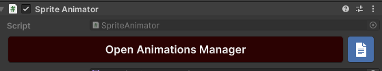
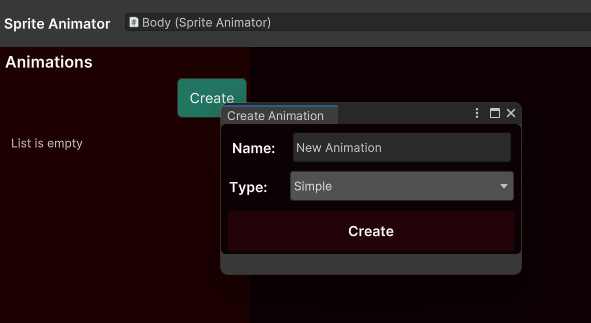
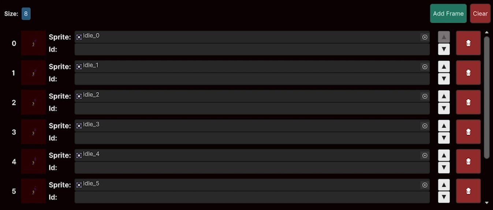
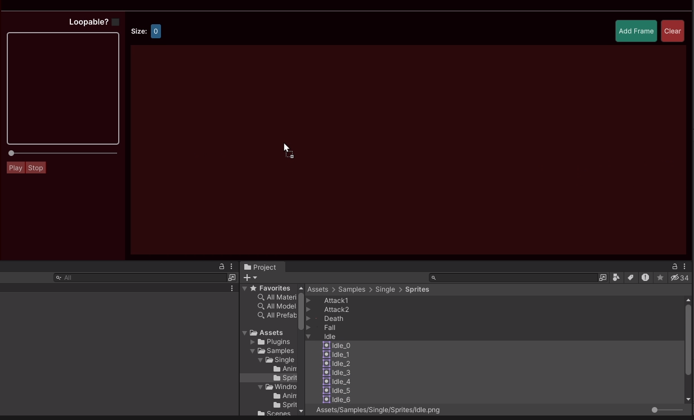

# Animations Manager

Where you prepare animations to be played using the [Sprite Animator](../sprite-animator/index.md).

There are 2 ways of acessing the Animations Manager window:

1. By clicking the `Open Animations Manager` present on the [Sprite Animator](../sprite-animator/index.md) component's inspector

2. Accessing `Tools > Sprite Animations > Animations Manager` and providing a sprite Animator to be loaded. You can even click the `From Selection` button to get the Sprite Animator of the currently selected GameObject.

## Creating an animation

Once you have selected a [Sprite Animator](../sprite-animator/index.md) you can go ahead and create some animations:

Provide a name, select the animation type and click create. Now all you have to do is select a folder to save the animation asset (it is a ScriptableObject) and
we can now start adding frames to that animation.

## Basic fields

All animations have these 2 basic fields:

- `Name` - Wich, well... is the name of the animation. This can be used to tell the [Sprite Animator](../sprite-animator/index.md) to play the animation.
- `FPS` - Wich is the frames per second rate in wich that animation will play.

Note that as we have multiple types of animations, we will need different layouts for each of them. But some elements will appear frequently.

## Frame Cycle

The Frame Cycle represents a collection of frames that must be played from the very first index (0) to whatever the last frame is. An animation may have
a single cycle, wich is the case of the [Single Animation](../animations/single-cycle-animation.md) or multiple cycles, wich is the case of the [Windrose Animation](../animations/windrose-animation.md).

## Adding Frames to a Frame Cycle

Defining frames for animations is really simple:

- **By Clicking the "Add Frame" button:**

Clicking the "Add Frame" button will create a new frame for the animation and insert it at the last position of the list.

Now just add a sprite to that frame and you are good to go.

- **Dragging a single sprite to the list**

Just select a sprite in the project window and drag it into the frames list. This you create a new frame, insert it at the last position
of the list and automatically load the sprite as the frame sprite.

- **By dragging a collection of sprites to the list**

1. Select multiple sprites representing the animation
2. Drag them into the list and release

This will create a Frame Cycle with all those sprites already loaded into its frames.

> [!Warning]
> This will completly override the previous Frames List. There will be a confirmation window, but be carefull.
