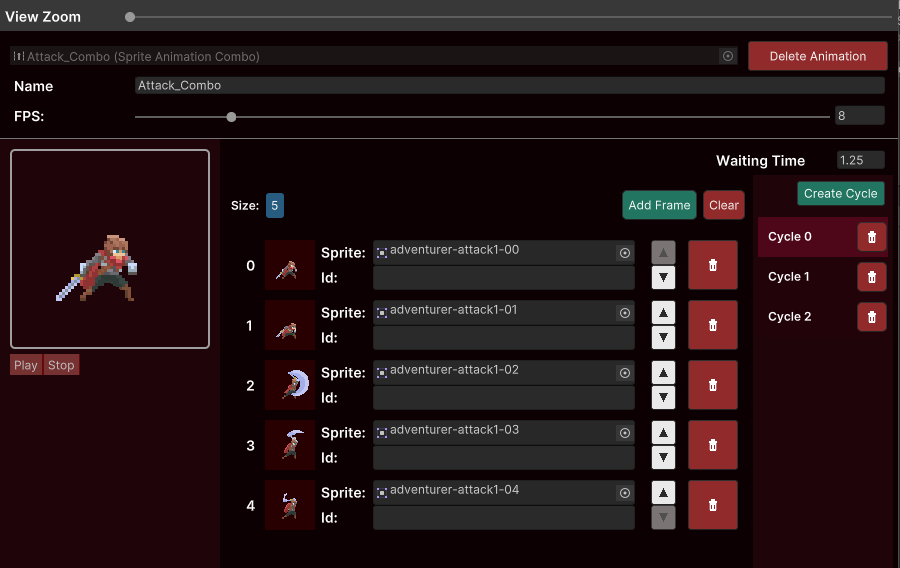

# Combo Animation



The combo animation is a collection of [Frame Cycles](../animations-manager/index.md#frame-cycle) with the purppose of
having their execution coordinated with player inputs.

While editing the animation you can define as many chained cycles and when scripting you will have the ability to
tell the [Combo Animator](../sprite-animator/combo-animator.md) when to play the next cycle untill the animation comes to
an end or the waiting time expires and the animation is considered interrupted.

Refer to the [Combo Animator](../sprite-animator/combo-animator.md) documentation in order to have a better understanding on how you can
operate a Combo Animation through code.

## Creating on demand

You can create Combo animations on demand by acessing the static method `SpriteAnimationCombo.OnDemand`. Just provide the fps, a list of [cycles](../animations-manager/index.md#frame-cycle) being each item of the list a list of Sprites.

Example:

```csharp
public SpriteAnimator _animator;
public int _fps;

public List<Sprite> _cycle0;
public List<Sprite> _cycle1;
public List<Sprite> _cycle2;

private SpriteAnimationCombo _animation;
private ComboAnimator _performer;

private void Awake()
{
    List<List<Sprite>> cycles = new()
    {
        _cycle0,
        _cycle1,
        _cycle2
    };

    _animation = SpriteAnimationCombo.OnDemand(_fps, cycles);
}

private void Start()
{
    StartAnimation();
}

private void StartAnimation()
{
    _performer = _animator.Play<ComboAnimator>(_animation).FromStart();
    _performer.SetOnCycleEnded(CycleEnded);

}

private void CycleEnded(int cycleIndex)
{
    if (cycleIndex < 2)
    {
        StartCoroutine(WaitAndPlayNext());
    }
    else
    {
        StartAnimation();
    }
}

private IEnumerator WaitAndPlayNext()
{
    yield return new WaitForSeconds(0.45f);
    _performer?.Next();
}
```

## Creating from a template

You can use any other Combo Animation as template for creating another Combo Animation. Just use the `UseAsTemplate` method providing
a list of [cycles](../animations-manager/index.md#frame-cycle) being each item of the list a list of Sprites

Example:

```csharp
public SpriteAnimator _animator;
public SpriteAnimationCombo _template;

public List<Sprite> _cycle0;
public List<Sprite> _cycle1;
public List<Sprite> _cycle2;

private SpriteAnimationCombo _animation;
private ComboAnimator _performer;

private void Awake()
{
    List<List<Sprite>> cycles = new()
    {
        _cycle0,
        _cycle1,
        _cycle2
    };

    _animation = _template.UseAsTemplate(cycles);
}

private void Start()
{
    StartAnimation();
}

private void StartAnimation()
{
    _performer = _animator.Play<ComboAnimator>(_animation).FromStart();
    _performer.SetOnCycleEnded(CycleEnded);

}

private void CycleEnded(int cycleIndex)
{
    if (cycleIndex < 2)
    {
        StartCoroutine(WaitAndPlayNext());
    }
    else
    {
        StartAnimation();
    }
}

private IEnumerator WaitAndPlayNext()
{
    yield return new WaitForSeconds(0.45f);
    _performer?.Next();
}
```
