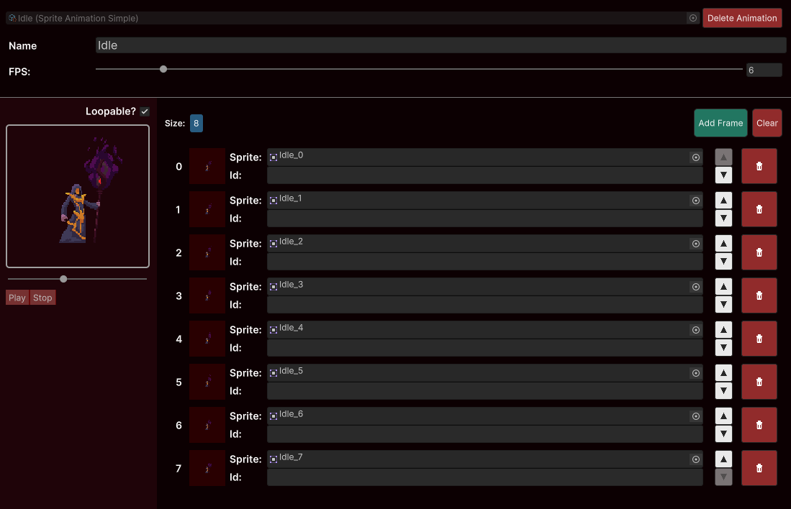

# Single Animation

The Single Animation is just a single [Frame Cycle](../animations-manager/index.md#frame-cycle).

Refer to [SingleAnimator](../sprite-animator/single-animator.md) in order to understand how you can interact with it through code.
