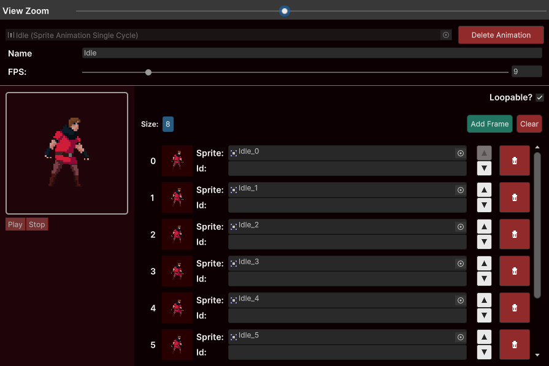

# Single Cycle Animation



The Single Cycle Animation is just a single [Frame Cycle](../animations-manager/index.md#frame-cycle).


Refer to [SingleCycleAnimator](../sprite-animator/single-cycle-animator.md) in order to understand how you can interact with it through code.

## Creating on demand

You can create Single Cycle animations on demand by acessing the static method `SpriteAnimationSingleCycle.OnDemand`. Just provide the fps, a [cycle](../animations-manager/index.md#frame-cycle) as a list of Sprites, and a boolean telling if it should be loopable or not.

Example:

```csharp
public SpriteAnimator _animator;
public int _fps;
public List<Sprite> _cycle;

private SpriteAnimationSingleCycle _animation;

private void Awake()
{
    _animation = SpriteAnimationSingleCycle.OnDemand(_fps, _cycle, true);
}

private void Start()
{
    _animator.Play(_animation);
}
```

## Creating from a template

You can use any other Single Cycle Animation as template for creating another Single Cycle Animation. Just use the `UseAsTemplate` method providing
a [cycle](../animations-manager/index.md#frame-cycle) as a list of Sprites.

Example:

```csharp
public SpriteAnimator _animator;
public SpriteAnimationSingleCycle _template;
public List<Sprite> _cycle;

private SpriteAnimationSingleCycle _animation;

private void Awake()
{
    _animation = _template.UseAsTemplate(_cycle);
}

private void Start()
{
    _animator.Play(_animation).SetOnFrame("Slash", frame => Debug.Log("Slash frame played"));
}
```
