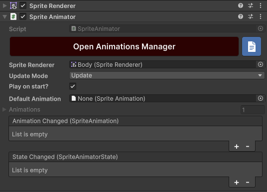
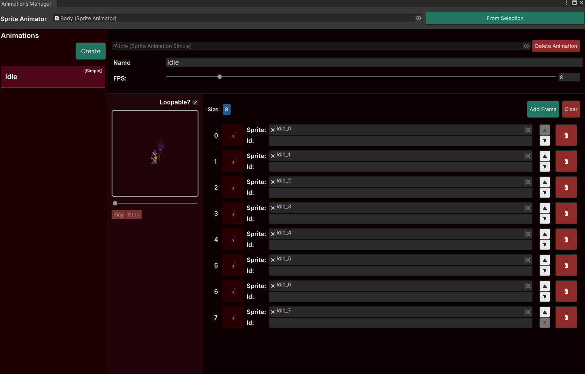

# How it works

It all comes down to a [MonoBehaviour](https://docs.unity3d.com/Manual/class-MonoBehaviour.html) responsible for animating [GameObjects](https://docs.unity3d.com/Manual/class-GameObject.html) by changing the sprites of a [SpriteRenderer](https://docs.unity3d.com/Manual/class-SpriteRenderer.html) based on the FPS defined for that particular animation.

## Work flow

- Attach the [SpriteAnimator](sprite-animator/index.md) component to a GameObject and feed it a SpriteRenderer.



- Then you will use the [Animations Manager](animations-manager/index.md) window to organize all the animations that animator can play during runtime.



- Create a Script (or scripts) and tell the animator wich animation to play using the [Play()](https://no-slopes.github.io/sprite-animations/api/SpriteAnimations.SpriteAnimator.html#SpriteAnimations_SpriteAnimator_Play_System_String_) method:


## Playing animations

Just tell the animator to play it:

```csharp
public SpriteAnimator _animator;

private void Start()
{
    _animator.Play("Idle");
}
```

or, if you do not like working with strings, you can reference an animation through inspector and use it:

```csharp
public SpriteAnimator _animator;
public SpriteAnimation _idleAnimation;

private void Start()
{
    _animator.Play(_idleAnimation);
}
```
