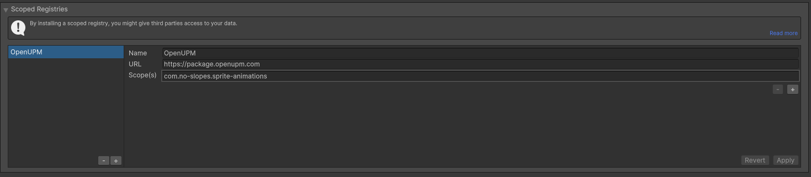

# How to install (2022.3+ only)

## Best way

- In Unity, Go to `Edit > Project Settings > Package Manager`
- Create a new scoped registry:
  - Name: `OpenUPM`
  - URL: `https://package.openupm.com`
  - Scope(s): `com.no-slopes.sprite-animations`
- Click Save. Now Sprite Animations is listed in the package manager.



- Go to the Unity Package Manager window and select `My Registries` then select install.


This is the best way because the Unity's Package Manager will inform you about new releases and allow you to update directly from
the Package Manager's window.


## Via OpenUPM CLI

- [Install the OpenUPM-CLI](https://openupm.com/docs/getting-started.html#installing-openupm-cli) if not installed already.
- [Install the Sprite Animations Package](https://openupm.com/docs/getting-started.html#installing-a-upm-package) by entering this into the command line while the directory is scoped on the root of your Unity project:

```
openupm add com.no-slopes.sprite-animations
```

## From Github

- Go to [the project's gihub page](https://github.com/no-slopes/sprite-animations) and pick a branch or tag from wich to install.

Refer to [this doc](https://docs.unity3d.com/Manual/upm-ui-giturl.html) for installing a package through a git repository and [this one](https://docs.unity3d.com/Manual/upm-git.html#syntax) if do not know how to compose the URL correctly.

The URL will look like this, if you want to install version (tag) v1.0.0:

`https://github.com/no-slopes/sprite-animations.git#v1.0.0`

## From a .unitypackage

[Pick a .unitypackage](https://github.com/no-slopes/sprite-animations/tree/main/UnityPackages) from a version you want and import it in your project.

[Click here](https://github.com/no-slopes/sprite-animations/blob/main/UnityPackages/sprite-animations_latest.unitypackage) to download the latest one.
