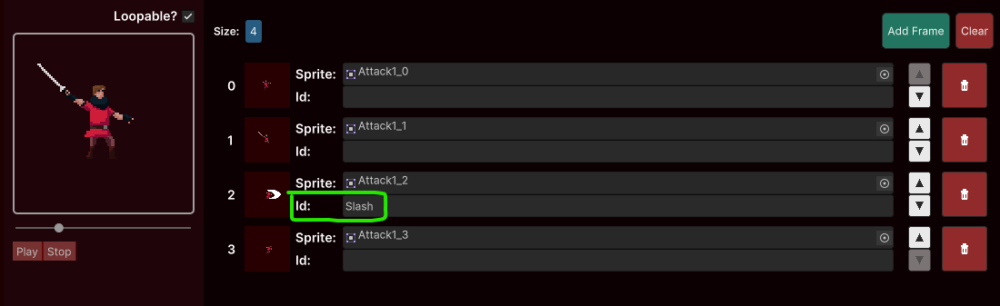

# Animation Performers

Since we need different [types of animations](../animations/index.md) in order to create the intended quality of life of the Sprite Animations solution, the [Sprite Animator](index.md) delegates the execution of the animation to a performer wich knows exactly how to interact with that animation. So, depending on the type of the animation, the [Play()](https://no-slopes.github.io/sprite-animations/api/SpriteAnimations.SpriteAnimator.html#SpriteAnimations_SpriteAnimator_Play_System_String_) method will return a different [AnimationPerformer](https://no-slopes.github.io/sprite-animations/api/SpriteAnimations.AnimationPerformer.html) based on the type of the animation requested.

Although all animations performers share basic features, it is important to know how you can interact with specific performers based on the type of animation
you are telling the [Sprite Animator](index.md) to play.

## Accessing performers

```csharp
private AnimationPerformer _perfomer;

private void Start()
{
    _perfomer = _animator.Play("Idle");
    _performer.SetOnEnd(() => { Debug.Log("The animation ended."); })
}
```

Yes. It is because of the performer we can chain methods like this:

```csharp
private void Start()
{
    _animator.Play("Idle").SetOnFrame(5, frame =>
    {
        Debug.Log("Frame indexed as 5 played.");
    }).SetOnEnd(() =>
    {
        Debug.Log("The animation ended.");
    });
}
```

> [!TIP]
> Chaining methods like this is a design pattern called [Fluent Interface](https://en.wikipedia.org/wiki/Fluent_interface)

## AnimationPerformer types

There is no need to worry about the AnimationPerfomer type if you only need basic usage for that specific animation. However, if you need specialized features of
an AnimationPerformer, you will need to access the right type of the desired AnimationPerformer child class.

For example, this is needed when you want to tell the [WindroseAnimator](windrose-animator.md) in wich direction it should play the animation.

Here are some examples on how you can access the correct performer type

**The "No Slopes preferred" way:**

Just like you do when using Unity's [GameObject.GetComponent](https://docs.unity3d.com/Manual/class-GameObject.html) method.

```csharp
WindroseAnimator windroseAnimator = _animator.Play<WindroseAnimator>("Idle");
```

We prefer this aproach since it already delivers the correct type and makes your code cleaner.

**Using the "as" keyword:**

```csharp
WindroseAnimator windroseAnimator = _animator.Play("Idle") as WindroseAnimator;
```

**The "explicit cast" way:**

```csharp
WindroseAnimator windroseAnimator = (WindroseAnimator)_animator.Play("Idle");
```

## Defining Actions

You can interact with the animation currently playing and specify actions to be fired when some event happen.

**Listening to every single frame**

```csharp
private AnimationPerformer _performer;

private void OnEnable()
{
    _performer = _animator.Play("Shoot");
    _performer.FramePlayed += OnFramePlayed;
}

private void OnDisable()
{
    // Unsubscribing so we avoid memory leaks
    if (_performer !=  null)
        _performer?.FramePlayed -= OnFramePlayed;
}

private void OnFramePlayed(int index, Frame frame)
{
    Debug.Log($"The frame {index} has just been played");
    // Proceed to do stuff based on that frame.
}
```

**Listen for when a specific frame is played:**

In case you need to perform some routine when a specific frame plays, it is easy. Use the `SetOnFrame()` method:

```csharp
public void PlayShoot()
{
    _animator.Play("Shoot").SetOnFrame(2, frame =>
    {
        Debug.Log("This is fired when the third frame is played.");
        Instantiate(_projectile);
    });
}
```

No need to unsubscribe since every time a new animation is played all its subscriptions are cleared.

While using the [Animations Manager](../animations-manager/index.md) window, you can even set IDs to frames so you can inform actions to be fired when
a frame associated with that ID plays:



```csharp
public void PlaySwordAttack()
{
    _animator.Play("Sword Attack").SetOnFrame("Slash", OnSwordSlash);
}

private void OnSwordSlash(Frame frame)
{
    Debug.Log("Slash frame played");
    // Check colisions and deal damage.
}
```

**When the animation ends:**

You can define an action to be fired when the animation ends (upon last frame being played) using the `SetOnEnd()` method:

```csharp
public void PlayDeath()
{
    _animator.Play("Death").SetOnEnd(AnnounceDeath);
}

private void AnnounceDeath()
{
    Debug.Log("This character id now Dead");
    // Start funeral
    // End gameplay
    // Reflect on life choices...
}
```

> [!NOTE]
> If the animation is marked as loopable, the `SetOnEnd()` action registered will be fired every time the last frame is played.
